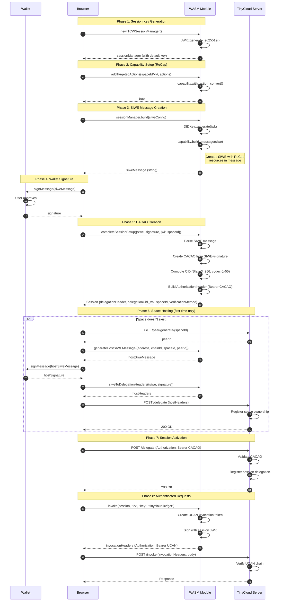
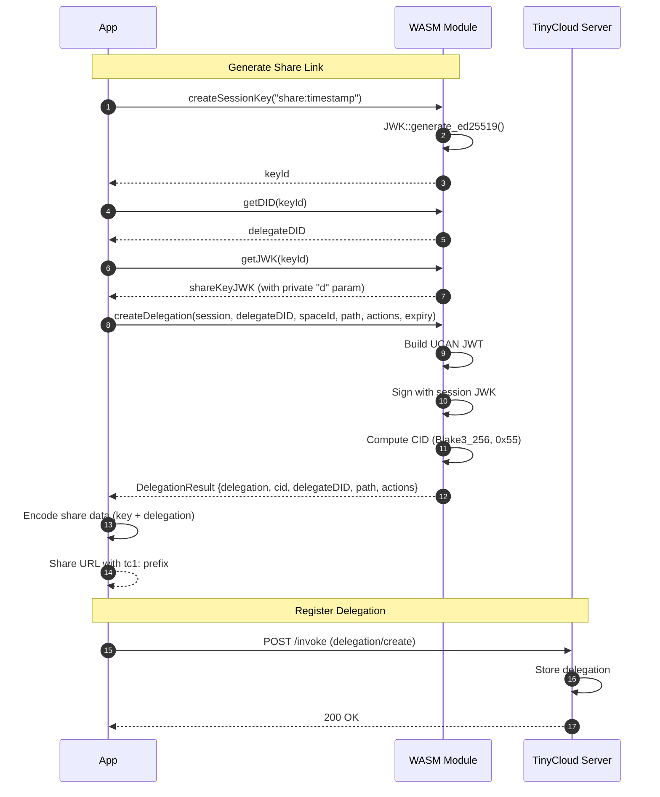

# TinyCloud Delegation Flow

This document describes how delegations work in the TinyCloud web-sdk, tracing the complete flow from session creation through authenticated requests.

## Overview

TinyCloud uses a hierarchical delegation model based on two standards:

1. **CACAO (Chain Agnostic CApability Object)**: Root delegations from wallet to session key, created via SIWE (Sign-In with Ethereum) messages with ReCap capabilities
2. **UCAN (User Controlled Authorization Network)**: Child delegations from session key to other DIDs (for sharing)

The delegation hierarchy enables:
- Ephemeral session keys that can act on behalf of the wallet
- Fine-grained capability control via resource paths and actions
- Sharing via sub-delegation without exposing wallet keys

## Key Concepts

### DID Formats

| Type | Format | Example |
|------|--------|---------|
| Session Key | `did:key:z6Mk...#z6Mk...` | `did:key:z6MkhaXgBZDvotDkL5257faiztiGiC2QtKLGpbnnEGta2doK#z6MkhaXgBZDvotDkL5257faiztiGiC2QtKLGpbnnEGta2doK` |
| PKH (Wallet) | `did:pkh:eip155:{chainId}:{address}` | `did:pkh:eip155:1:0x742d35Cc6634C0532925a3b844Bc9e7595f1Ac8b` |

### Space ID Format

Spaces are identified using the format:
```
tinycloud:pkh:eip155:{chainId}:{address}:{prefix}
```

Example: `tinycloud:pkh:eip155:1:0x742d35Cc6634C0532925a3b844Bc9e7595f1Ac8b:default`

**Code Reference**: `packages/sdk-rs/web-sdk-wasm/tinycloud_web_sdk_rs.d.ts:208`
```typescript
export function makeSpaceId(address: string, chainId: number, name: string): string;
```

### Resource URI Format

Capabilities use resource URIs in the format:
```
{spaceId}/{service}/{path}
```

Example: `tinycloud:pkh:eip155:1:0x742d35....:default/kv/documents/`

### Ability Format

Actions follow the `{namespace}.{service}/{action}` format:

| Ability | Description |
|---------|-------------|
| `tinycloud.kv/get` | Read KV entries |
| `tinycloud.kv/put` | Write KV entries |
| `tinycloud.kv/list` | List KV entries |
| `tinycloud.kv/del` | Delete KV entries |
| `tinycloud.kv/metadata` | Read KV metadata |
| `tinycloud.capabilities/read` | Read user capabilities |
| `tinycloud.delegation/create` | Create delegations |
| `tinycloud.delegation/revoke` | Revoke delegations |

**Code Reference**: `packages/sdk-core/src/delegations/DelegationManager.ts:31-37`

## Complete Delegation Flow



## Detailed Phase Breakdown

### Phase 1: Session Key Generation

A new Ed25519 key pair is generated in the WASM module when `TCWSessionManager` is instantiated.

**Code Reference**: `packages/sdk-rs/src/session/manager.rs:33-55`
```rust
pub fn new() -> Result<SessionManager, String> {
    let key_id = DEFAULT_KEY_ID.to_string();
    let mut sessions: HashMap<String, SessionInfo> = HashMap::new();
    let mut default_key: JWK = JWK::generate_ed25519()
        .map_err(|error| format!("failed to generate session key: {}", error))?;

    default_key.key_id = Some(key_id.clone());
    // ...
}
```

**Code Reference**: `packages/web-sdk/src/modules/UserAuthorization.ts:236-250`
```typescript
let builder;
try {
  builder = await initialized.then(
    () => new tcwSession.TCWSessionManager()
  );
} catch (err) {
  // ...
}
```

### Phase 2: Capability Setup (ReCap)

Capabilities are added to the session using `addTargetedActions()`. This builds ReCap statements that will be included in the SIWE message.

**Code Reference**: `packages/sdk-rs/src/session/manager.rs:132-157`
```rust
pub fn add_targeted_actions(&mut self, target: String, actions: Vec<JsString>) -> bool {
    for action in actions {
        if let Err(e) = self.capability.with_action_convert(
            target.parse::<UriString>().unwrap(),
            action.parse::<Ability>().unwrap(),
            Vec::<std::collections::BTreeMap<String, Value>>::new(),
        ) {
            log_error(&format!("Failed to add targeted action: {}", e));
            return false;
        }
    }
    true
}
```

**Code Reference**: `packages/web-sdk/src/modules/UserAuthorization.ts:344-357`
```typescript
public addDefaultCapabilities(address: string, chainId: number, prefix: string = "default"): void {
  const spaceId = makeSpaceId(address, chainId, prefix);
  const kvTarget = `${spaceId}/kv/`;
  this.builder.addTargetedActions(kvTarget, UserAuthorizationConnected.DEFAULT_KV_ACTIONS);

  const capabilitiesTarget = `${spaceId}/capabilities/all/`;
  this.builder.addTargetedActions(capabilitiesTarget, UserAuthorizationConnected.DEFAULT_CAPABILITIES_ACTIONS);
}
```

Default KV actions: `packages/web-sdk/src/modules/UserAuthorization.ts:295-301`
```typescript
private static readonly DEFAULT_KV_ACTIONS = [
  "tinycloud.kv/put",
  "tinycloud.kv/get",
  "tinycloud.kv/list",
  "tinycloud.kv/del",
  "tinycloud.kv/metadata",
];
```

### Phase 3: SIWE Message Creation

The `build()` method creates a SIWE message with ReCap capabilities embedded in the resources.

**Code Reference**: `packages/sdk-rs/src/session/manager.rs:63-129`
```rust
pub fn build(
    self,
    config: SiweConfig,
    key_id: Option<String>,
    custom_uri: Option<String>,
) -> Result<String, JsValue> {
    let did_uri_string = match custom_uri {
        Some(uri) => uri,
        None => self.get_did(key_id)?,
    };

    // ... build Message struct ...

    let siwe = self.capability
        .build_message(message)
        .map_err(|build_error| format!("unable to build siwe message: {}", build_error))?;
    Ok(siwe.to_string())
}
```

The URI field contains the session key DID (`did:key:z6Mk...#z6Mk...`), identifying who receives the delegation.

**Code Reference**: `packages/sdk-rs/src/session/manager.rs:226-236`
```rust
pub fn get_did(&self, key_id: Option<String>) -> Result<String, String> {
    let did = DIDKey::generate(&self.get_private_key(key_id)?)
        .map_err(|e| format!("unable to generate the DID of the session key: {e}"))?;
    let did_str = did.to_string();
    let fragment = did_str.rsplit_once(':').ok_or_else(|| "Failed to extract DID fragment".to_string())?.1;
    Ok(format!("{}#{}", did_str, fragment))
}
```

### Phase 4: Wallet Signature

The browser requests a signature from the connected wallet.

**Code Reference**: `packages/web-sdk/src/modules/UserAuthorization.ts:406-408`
```typescript
const siweConfig = merge(defaults, this.config.siweConfig);
const siwe = this.builder.build(siweConfig);
const signature = await signer.signMessage(siwe);
```

### Phase 5: CACAO Creation

The signed SIWE message is converted to a CACAO (Chain Agnostic CApability Object).

**Code Reference**: `packages/sdk-rs/web-sdk-wasm/tinycloud_web_sdk_rs.d.ts:154`
```typescript
export function completeSessionSetup(config: any): any;
```

**Code Reference**: `packages/web-sdk/src/modules/UserAuthorization.ts:1101-1143`
```typescript
private async setupSpaceSession(session: TCWClientSession): Promise<void> {
  // ...
  const sessionData = {
    jwk: JSON.parse(session.sessionKey),
    spaceId: this._spaceId,
    service: "kv",
    siwe: session.siwe,
    signature: session.signature,
    verificationMethod,
  };

  const completedSession = completeSessionSetup(sessionData);
  if (completedSession?.delegationHeader) {
    this._delegationHeader = completedSession.delegationHeader;
    this._tinycloudSession = {
      delegationHeader: completedSession.delegationHeader,
      delegationCid: completedSession.delegationCid,
      jwk: JSON.parse(session.sessionKey),
      spaceId: this._spaceId,
      verificationMethod,
    };
  }
}
```

### Phase 6: Space Hosting

For new spaces, a hosting delegation must be created first.

**Code Reference**: `packages/sdk-core/src/space.ts:30-44`
```typescript
export async function fetchPeerId(host: string, spaceId: string): Promise<string> {
  const res = await fetch(`${host}/peer/generate/${encodeURIComponent(spaceId)}`);
  if (!res.ok) {
    const error = await res.text().catch(() => res.statusText);
    throw new Error(`Failed to get peer ID: ${res.status} - ${error}`);
  }
  return res.text();
}
```

**Code Reference**: `packages/web-sdk/src/modules/UserAuthorization.ts:969-1018`
```typescript
private async hostSpace(): Promise<boolean> {
  const peerId = await fetchPeerId(host, spaceId);

  const siwe = generateHostSIWEMessage({
    address, chainId, domain, issuedAt, spaceId, peerId,
  });

  const signature = await this.signMessage(siwe);
  const headers = siweToDelegationHeaders({ siwe, signature });
  const submitResult = await submitHostDelegation(host, headers);
  // ...
}
```

### Phase 7: Session Activation

The session delegation (CACAO) is submitted to the server.

**Code Reference**: `packages/sdk-core/src/space.ts:82-96`
```typescript
export async function activateSessionWithHost(
  host: string,
  delegationHeader: { Authorization: string }
): Promise<SpaceHostResult> {
  const res = await fetch(`${host}/delegate`, {
    method: "POST",
    headers: delegationHeader,
  });

  return {
    success: res.ok,
    status: res.status,
    error: res.ok ? undefined : await res.text().catch(() => res.statusText),
  };
}
```

### Phase 8: Authenticated Requests

For each operation, a UCAN invocation token is created.

**Code Reference**: `packages/sdk-services/src/types.ts:126-132`
```typescript
export type InvokeFunction = (
  session: ServiceSession,
  service: string,
  path: string,
  action: string,
  facts?: InvocationFacts
) => ServiceHeaders;
```

**Code Reference**: `packages/web-sdk/src/modules/Storage/tinycloud/authenticator.ts:69-82`
```typescript
export class Authenticator {
  private session: Session;
  constructor(session: Session) {
    this.session = session;
  }

  invocationHeaders = (
    service: string,
    action: string,
    path: string
  ): HeadersInit =>
    invoke(this.session, service, path, action, undefined);
  getSpaceId = (): string => this.session.spaceId;
}
```

## Child Delegation (UCAN) Creation

For sharing, child UCANs are created that delegate from the session key to another DID.



**Code Reference**: `packages/sdk-rs/web-sdk-wasm/tinycloud_web_sdk_rs.d.ts:176-193`
```typescript
/**
 * Create a delegation UCAN from a session to another DID.
 * This allows session keys to delegate capabilities to other users client-side.
 *
 * # Arguments
 * * `session` - The current session (with JWK and delegation info)
 * * `delegateDID` - The recipient's DID (audience of the delegation)
 * * `spaceId` - The space being delegated
 * * `path` - Path scope for the delegation
 * * `actions` - Actions to delegate
 * * `expirationSecs` - Expiration timestamp in seconds since epoch
 * * `notBeforeSecs` - Optional not-before timestamp
 *
 * # Returns
 * A `DelegationResult` containing:
 * * `delegation` - Base64url-encoded UCAN JWT string
 * * `cid` - CID of the delegation
 * * `delegateDID` - The delegate's DID
 * * `path` - Path scope
 * * `actions` - Delegated actions
 * * `expiry` - Expiration timestamp
 */
export function createDelegation(
  session: any,
  delegateDID: string,
  spaceId: string,
  path: string,
  actions: string[],
  expirationSecs: number,
  notBeforeSecs: any
): any;
```

**Code Reference**: `packages/sdk-core/src/delegations/SharingService.ts:360-499`
```typescript
async generate(params: GenerateShareParams): Promise<Result<ShareLink, DelegationError>> {
  // Step 1: Spawn a new session key unique to this share
  const shareKeyName = `share:${Date.now()}:${Math.random().toString(36).substring(2, 10)}`;
  keyId = await this.keyProvider.createSessionKey(shareKeyName);
  keyDid = await this.keyProvider.getDID(keyId);
  keyJwk = this.keyProvider.getJWK(keyId) as JWK;

  // Step 2: Create delegation from current session to spawned key
  const delegationParams: CreateDelegationParams = {
    delegateDID: keyDid,
    path: params.path,
    actions,
    expiry,
    disableSubDelegation: false,
  };

  const delegationResult = this.createDelegationFn
    ? await this.createDelegationFn(delegationParams)
    : await this.delegationManager!.create(delegationParams);

  // Step 3: Package the share data
  const shareData: EncodedShareData = {
    key: keyJwk,
    keyDid,
    delegation,
    path: params.path,
    host: this.host,
    spaceId: this.session.spaceId,
    version: 1,
  };

  // Step 4: Encode the link
  const encodedData = this.encodeLink(shareData, schema);
  // ...
}
```

## CID Computation

CIDs are computed using Blake3_256 hash with codec 0x55 (raw).

**Code Reference**: `packages/sdk-rs/web-sdk-wasm/tinycloud_web_sdk_rs.d.ts:157-169`
```typescript
/**
 * Compute a CID from data bytes using Blake3_256 hash.
 *
 * This uses the same hashing algorithm as the TinyCloud server,
 * ensuring CID consistency between client and server.
 *
 * # Arguments
 * * `data` - The bytes to hash
 * * `codec` - The multicodec code (e.g., 0x55 for raw)
 *
 * # Returns
 * The CID as a string (base32 multibase encoded)
 */
export function computeCid(data: Uint8Array, codec: bigint): string;
```

## Key Data Structures

### Session

**Code Reference**: `packages/web-sdk/src/modules/Storage/tinycloud/types.ts:30-42`
```typescript
export type Session = {
  /** The delegation from the user to the session key. */
  delegationHeader: { Authorization: string };
  /** The delegation reference from the user to the session key. */
  delegationCid: string;
  /** The session key. */
  jwk: object;
  /** The space that the session key is permitted to perform actions against. */
  spaceId: string;
  /** The verification method of the session key. */
  verificationMethod: string;
};
```

### ServiceSession

**Code Reference**: `packages/sdk-services/src/types.ts:78-89`
```typescript
export interface ServiceSession {
  /** The delegation header containing the UCAN */
  delegationHeader: { Authorization: string };
  /** The delegation CID */
  delegationCid: string;
  /** The space ID for this session */
  spaceId: string;
  /** The verification method DID */
  verificationMethod: string;
  /** The session key JWK (required for invoke) */
  jwk: object;
}
```

### Delegation

**Code Reference**: `packages/sdk-core/src/delegations/types.ts:266-291`
```typescript
export interface Delegation {
  /** Content identifier (CID) of the delegation */
  cid: string;
  /** DID of the delegate (the party receiving the delegation) */
  delegateDID: string;
  /** Space ID this delegation applies to */
  spaceId: string;
  /** Resource path this delegation grants access to */
  path: string;
  /** Actions this delegation authorizes */
  actions: string[];
  /** When this delegation expires */
  expiry: Date;
  /** Whether this delegation has been revoked */
  isRevoked: boolean;
  /** DID of the delegator (the party granting the delegation) */
  delegatorDID?: string;
  /** When this delegation was created */
  createdAt?: Date;
  /** Parent delegation CID if this is a sub-delegation */
  parentCid?: string;
  /** Whether sub-delegation is allowed */
  allowSubDelegation?: boolean;
  /** Authorization header (UCAN bearer token) - optional, for sharing links */
  authHeader?: string;
}
```

### CreateDelegationParams

**Code Reference**: `packages/sdk-core/src/delegations/types.ts:296-309`
```typescript
export interface CreateDelegationParams {
  /** DID of the delegate (the party receiving the delegation) */
  delegateDID: string;
  /** Resource path this delegation grants access to */
  path: string;
  /** Actions to authorize */
  actions: string[];
  /** When this delegation expires (defaults to session expiry) */
  expiry?: Date;
  /** Whether to disable sub-delegation (default: false) */
  disableSubDelegation?: boolean;
  /** Optional statement for the SIWE message */
  statement?: string;
}
```

## Server Endpoints

| Endpoint | Method | Purpose | Headers |
|----------|--------|---------|---------|
| `/peer/generate/{spaceId}` | GET | Get peer ID for space hosting | None |
| `/delegate` | POST | Register delegation (host or session) | `Authorization: Bearer <CACAO>` |
| `/invoke` | POST | Execute authenticated operation | `Authorization: Bearer <UCAN>` |

## Delegation Chain Rules

1. **Expiry**: Child delegation expiry must be <= parent delegation expiry
2. **Not Before**: Child not_before must be >= parent not_before
3. **DID Match**: Server matches `delegatee == delegator` exactly (DID string match)
4. **Path Scope**: Child path must be within parent path scope
5. **Actions**: Child actions must be subset of parent actions

## Summary

The TinyCloud delegation system provides:

1. **Secure Session Management**: Ephemeral session keys protect wallet keys
2. **Fine-grained Capabilities**: ReCap/UCAN enable precise access control
3. **Sharing**: Child delegations allow secure resource sharing
4. **Offline Creation**: Delegations can be created client-side without server
5. **CID Consistency**: Shared Blake3_256 hashing ensures client/server agreement
