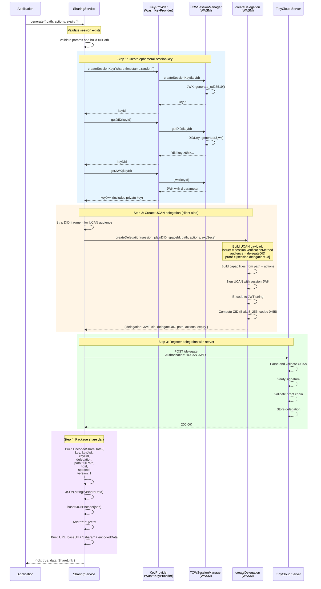
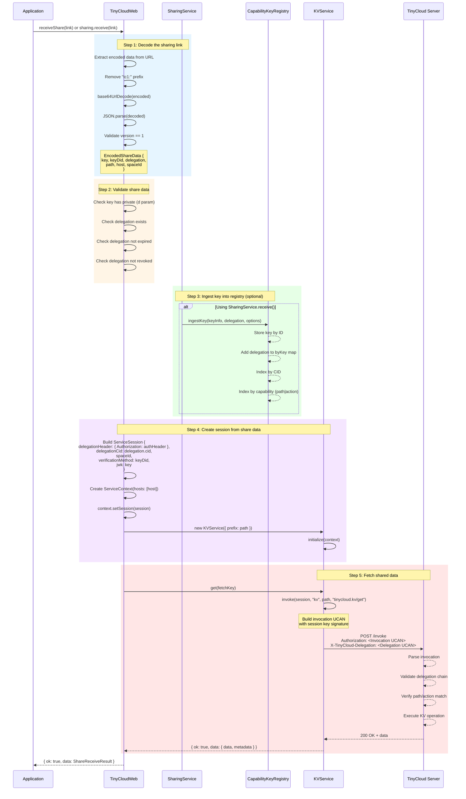

# TinyCloud Sharing Links Flow

This document describes how sharing links work in the TinyCloud web-sdk, including detailed sequence diagrams for the GENERATE (Alice creates link) and RECEIVE (Bob uses link) flows.

## Overview

TinyCloud v2 sharing links use an **embedded private key** design. When Alice creates a sharing link:
1. A new ephemeral key pair is generated client-side
2. Alice delegates capabilities to this ephemeral key via a UCAN
3. The private key and delegation are encoded into the sharing link
4. Bob can use the link without any prior session setup

This design enables **offline-first sharing** - the delegation is created entirely client-side without requiring server roundtrips, though the delegation is registered with the server for chain validation.

### Link Format

Sharing links use base64url encoding with a `tc1:` prefix:

```
tc1:<base64url-encoded-JSON>
```

The encoded JSON contains:
- `key`: JWK with private key (d parameter)
- `keyDid`: DID of the ephemeral key
- `delegation`: The UCAN delegation object
- `path`: Resource path the link grants access to
- `host`: TinyCloud server URL
- `spaceId`: Space identifier
- `version`: Schema version (currently 1)

---

## GENERATE Flow (Alice Creates Sharing Link)

When Alice calls `sharing.generate()`, the following sequence occurs:



### Key Code References (GENERATE)

| Step | File | Line | Description |
|------|------|------|-------------|
| Entry point | `packages/sdk-core/src/delegations/SharingService.ts` | 381-589 | `generate()` method |
| Create session key | `packages/sdk-core/src/delegations/SharingService.ts` | 441-466 | KeyProvider calls |
| WASM key creation | `packages/sdk-rs/src/session/manager.rs` | 159-177 | `create_session_key()` |
| DID generation | `packages/sdk-rs/src/session/manager.rs` | 226-236 | `get_did()` |
| WASM delegation | `repositories/tinycloud-node/tinycloud-sdk-wasm/src/lib.rs` | 139-185 | `createDelegation()` |
| Session.create_delegation | `repositories/tinycloud-node/tinycloud-sdk-wasm/src/session.rs` | 198-258 | UCAN building and signing |
| CID computation | `repositories/tinycloud-node/tinycloud-sdk-wasm/src/session.rs` | 247-248 | Blake3_256, codec 0x55 |
| Server registration | `packages/sdk-core/src/delegations/SharingService.ts` | 489-505 | POST /delegate |
| Link encoding | `packages/sdk-core/src/delegations/SharingService.ts` | 744-751 | `encodeLink()` |

---

## RECEIVE Flow (Bob Uses Sharing Link)

When Bob calls `sharing.receive(link)` or uses `TinyCloudWeb.receiveShare(link)`:



### Key Code References (RECEIVE)

| Step | File | Line | Description |
|------|------|------|-------------|
| Static receive | `packages/web-sdk/src/modules/tcw.ts` | 310-414 | `TinyCloudWeb.receiveShare()` |
| Service receive | `packages/sdk-core/src/delegations/SharingService.ts` | 602-735 | `receive()` method |
| Decode link | `packages/sdk-core/src/delegations/SharingService.ts` | 760-797 | `decodeLink()` |
| Base64 decode | `packages/sdk-core/src/delegations/SharingService.ts` | 103-118 | `base64UrlDecode()` |
| Ingest key | `packages/sdk-core/src/authorization/CapabilityKeyRegistry.ts` | 394-414 | `ingestKey()` |
| Add delegation | `packages/sdk-core/src/authorization/CapabilityKeyRegistry.ts` | 569-614 | `addDelegation()` |
| Build session | `packages/web-sdk/src/modules/tcw.ts` | 356-371 | ServiceSession construction |
| KV service | `packages/sdk-core/src/delegations/SharingService.ts` | 718-724 | `createKVService()` call |

---

## Key Data Structures

### EncodedShareData

```typescript
interface EncodedShareData {
  /** Private key in JWK format (includes d parameter) */
  key: JWK;
  /** DID of the key (did:key:z6Mk...#z6Mk...) */
  keyDid: string;
  /** The delegation granting access */
  delegation: Delegation;
  /** Resource path this link grants access to */
  path: string;
  /** TinyCloud host URL */
  host: string;
  /** Space ID */
  spaceId: string;
  /** Schema version */
  version: 1;
}
```

**Source**: `packages/sdk-core/src/delegations/SharingService.ts:127-142`

### Delegation

```typescript
interface Delegation {
  /** Content identifier (CID) of the delegation */
  cid: string;
  /** DID of the delegate (the party receiving the delegation) */
  delegateDID: string;
  /** Space ID this delegation applies to */
  spaceId: string;
  /** Resource path this delegation grants access to */
  path: string;
  /** Actions this delegation authorizes (e.g., ["tinycloud.kv/get"]) */
  actions: string[];
  /** When this delegation expires */
  expiry: Date;
  /** Whether this delegation has been revoked */
  isRevoked: boolean;
  /** Authorization header (UCAN bearer token) - for sharing links */
  authHeader?: string;
  /** Whether sub-delegation is allowed */
  allowSubDelegation?: boolean;
}
```

**Source**: `packages/sdk-core/src/delegations/types.ts:266-291`

### DelegationResult (WASM)

```rust
struct DelegationResult {
    /// Base64url-encoded UCAN JWT string
    delegation: String,
    /// CID of the delegation (for referencing in proof chains)
    cid: String,
    /// The DID of the delegate (recipient)
    delegate_did: String,
    /// Path scope of the delegation
    path: String,
    /// Actions delegated
    actions: Vec<String>,
    /// Expiration timestamp in seconds since epoch
    expiry: f64,
}
```

**Source**: `repositories/tinycloud-node/tinycloud-sdk-wasm/src/session.rs:262-277`

---

## Server Endpoint Details

### POST /delegate

Registers a client-created delegation with the server for proof chain validation.

**Request**:
```http
POST /delegate HTTP/1.1
Host: node.tinycloud.xyz
Authorization: eyJhbGciOiJFZERTQSIsInR5cCI6IkpXVCJ9... (UCAN JWT)
```

**Response**:
- `200 OK`: Delegation registered successfully
- `400 Bad Request`: Invalid UCAN format
- `401 Unauthorized`: Signature verification failed
- `403 Forbidden`: Proof chain validation failed

**Code Reference**: `packages/sdk-core/src/delegations/SharingService.ts:489-505`

### POST /invoke

Executes a KV operation using the delegated capabilities.

**Request**:
```http
POST /invoke HTTP/1.1
Host: node.tinycloud.xyz
Authorization: eyJhbGciOiJFZERTQSIsInR5cCI6IkpXVCJ9... (Invocation UCAN)
X-TinyCloud-Delegation: eyJhbGciOiJFZERTQSIsInR5cCI6IkpXVCJ9... (Delegation UCAN)
Content-Type: application/json

{"service":"kv","path":"shared/document.json","action":"tinycloud.kv/get"}
```

**Response**:
- `200 OK`: Operation succeeded, returns data
- `401 Unauthorized`: Invalid invocation
- `403 Forbidden`: Delegation chain invalid or action not authorized
- `404 Not Found`: Resource not found

---

## UCAN Delegation Structure

The client-side created UCAN follows this structure:

```
Header:
  alg: EdDSA
  typ: JWT

Payload:
  iss: did:key:z6Mk...#z6Mk...  (Alice's session key DID)
  aud: did:key:z6Mk...          (Ephemeral share key DID, no fragment)
  exp: 1704067200               (Expiration timestamp)
  nbf: 1703980800               (Optional not-before)
  nnc: urn:uuid:...             (Random nonce)
  prf: [bafy...]                (Parent delegation CID)
  att: {                        (Attenuations/capabilities)
    "tinycloud:pkh:...:default:kv:shared/doc": {
      "tinycloud.kv/get": [{}]
    }
  }

Signature:
  Base64url-encoded Ed25519 signature
```

**CID Computation**:
- Hash algorithm: Blake3_256
- Codec: 0x55 (raw)
- Input: JWT string bytes

**Code Reference**: `repositories/tinycloud-node/tinycloud-sdk-wasm/src/session.rs:221-248`

---

## Flow Comparison: Static vs Instance Receive

There are two ways to receive a share link:

### 1. Static Method (No Auth Required)

```typescript
// No TinyCloudWeb instance needed
const result = await TinyCloudWeb.receiveShare('tc1:...');
if (result.ok) {
  console.log(result.data.data); // The shared data
}
```

**Use case**: Anonymous access, embedding shared content, one-time retrieval.

**Code**: `packages/web-sdk/src/modules/tcw.ts:310-414`

### 2. Instance Method (With Session)

```typescript
const tcw = new TinyCloudWeb({ useNewAuth: true });
await tcw.signIn();

const result = await tcw.sharing.receive('tc1:...');
if (result.ok) {
  // Key is ingested into registry for future use
  const kvService = result.data.kv;
  await kvService.put('notes.txt', 'Hello!');
}
```

**Use case**: Persistent access, sub-delegation, multiple operations.

**Code**: `packages/sdk-core/src/delegations/SharingService.ts:602-735`

---

## Security Considerations

1. **Private Key in Link**: The link contains the private key, so anyone with the link has access. Links should be treated as secrets.

2. **Expiration**: Delegations have built-in expiration (default 24 hours). The link becomes invalid after expiry.

3. **Revocation**: The delegation can be revoked server-side using `delegations.revoke(cid)`, invalidating the link immediately.

4. **Path Scoping**: Delegations are scoped to a specific path. A link for `shared/document.json` cannot access `private/`.

5. **Action Restrictions**: Only the specified actions are allowed (e.g., read-only with just `tinycloud.kv/get`).

6. **Proof Chain Validation**: The server validates the full delegation chain, ensuring the delegator had permission to grant the delegation.
